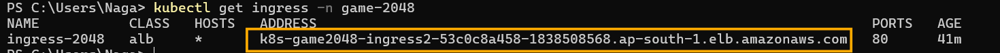

# terraform_gitactn_eks_game2048
This repository about deploying a sample game on eks cluster using git actions &amp; terraform

Provisioning an Amazon EKS (Elastic Kubernetes Service) cluster using Terraform

Deploying the Game 2048 app

Automating deployments via GitHub Actions

# terraform_gitactn_eks_game2048

## 🎯 Project Overview

This project automates the deployment of the [2048 game](https://github.com/gabrielecirulli/2048) to an Amazon EKS (Elastic Kubernetes Service) cluster using **Terraform** and **GitHub Actions**.

Key components:

- **Terraform**: Infrastructure as Code for provisioning AWS EKS and related resources.
- **GitHub Actions**: CI/CD pipeline to automate deployment.
- **Kubernetes**: Used to run the Game 2048 application.
- **Game 2048**: Lightweight front-end game deployed on EKS.

## 📦 Project Structure

terraform_gitactn_eks_game2048/
├── .github/
│ └── workflows/
│ └── deploy.yaml # GitHub Actions workflow for CI/CD
├── terraform/
│ ├── main.tf # Main Terraform configuration
│ ├── variables.tf # Input variables
│ ├── outputs.tf # Outputs (e.g., kubeconfig, EKS endpoint)
│ └── provider.tf # AWS provider configuration
└── README.md

## ⚙️ Prerequisites

- [AWS CLI](https://docs.aws.amazon.com/cli/latest/userguide/install-cliv2.html)
- [Terraform](https://www.terraform.io/downloads)
- [kubectl](https://kubernetes.io/docs/tasks/tools/)
- [GitHub CLI](https://cli.github.com/) (optional, for managing secrets)

---

## 🚀 Deployment Steps

### 1. Clone the Repository

git clone https://github.com/<your-username>/terraform_gitactn_eks_game2048.git
cd terraform_gitactn_eks_game2048

2. Configure AWS Credentials
Export your AWS credentials or set them in your environment:

export AWS_ACCESS_KEY_ID=your_access_key
export AWS_SECRET_ACCESS_KEY=your_secret_key

3. Deploy Infrastructure Using Terraform (Or) push same dir to your git repository and in "Actions" option choose the work flow and choose apply to create resources in "Run Workflows" option at right side 

cd terraform
terraform init
terraform plan 
terraform apply -auto-approve

4. Configure kubectl

aws eks --region <your-region> update-kubeconfig --name <your-cluster-name>

